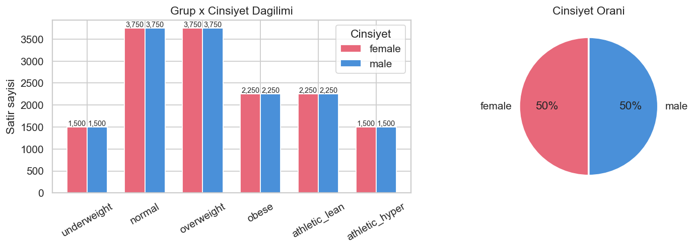
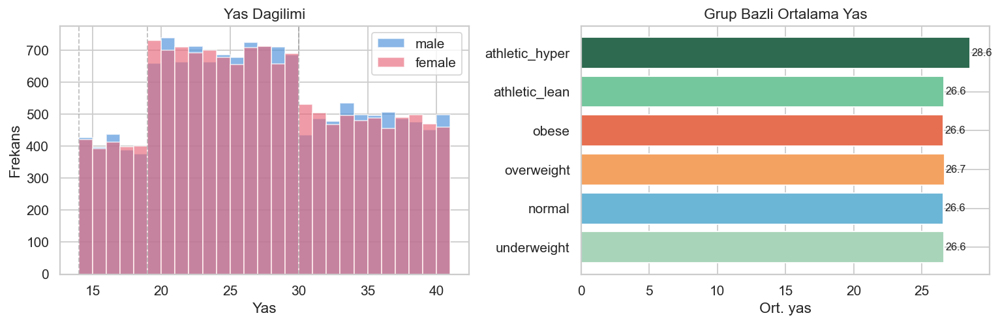
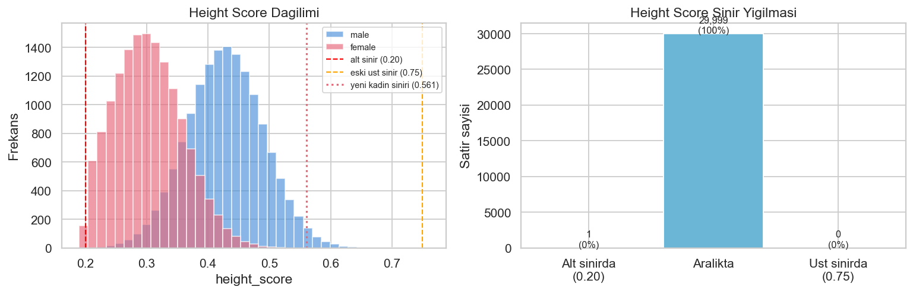
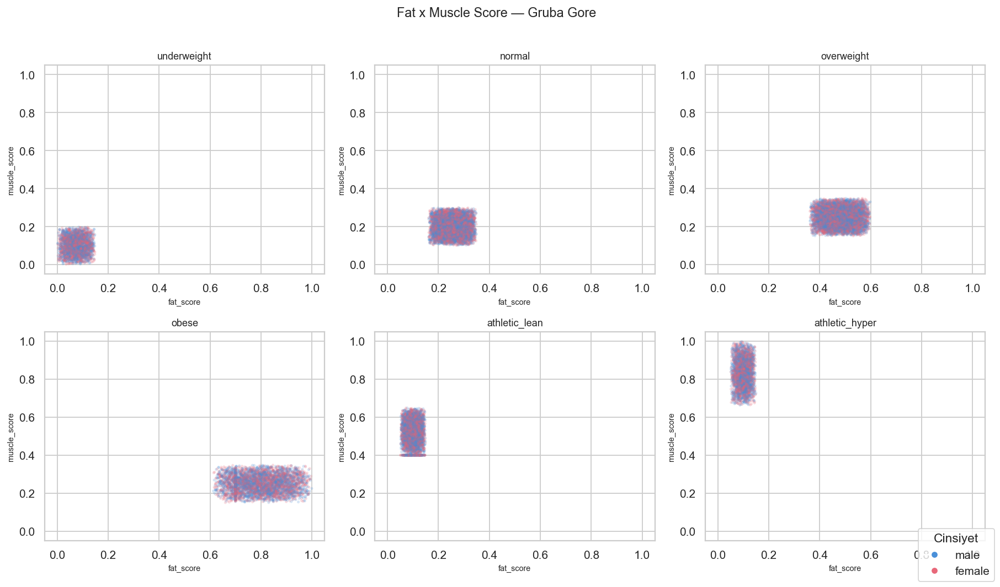
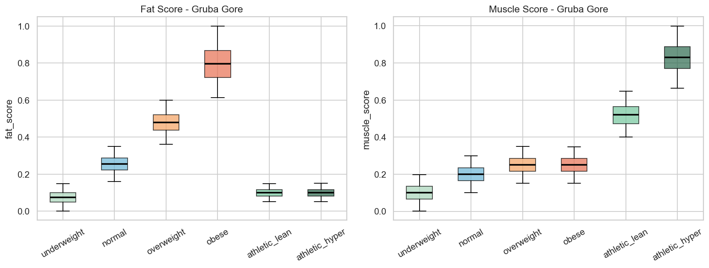
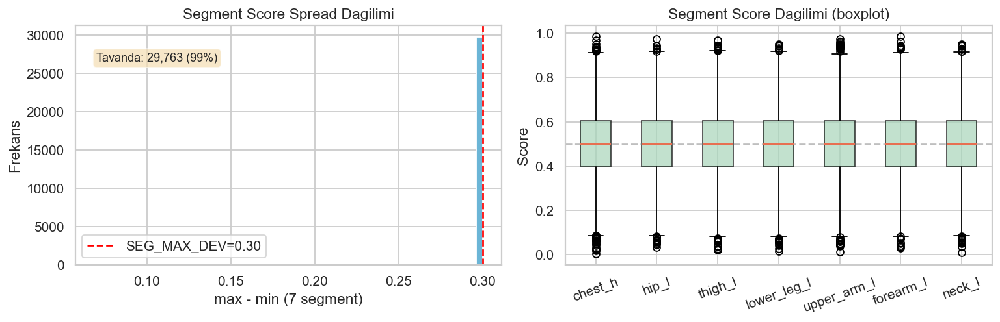
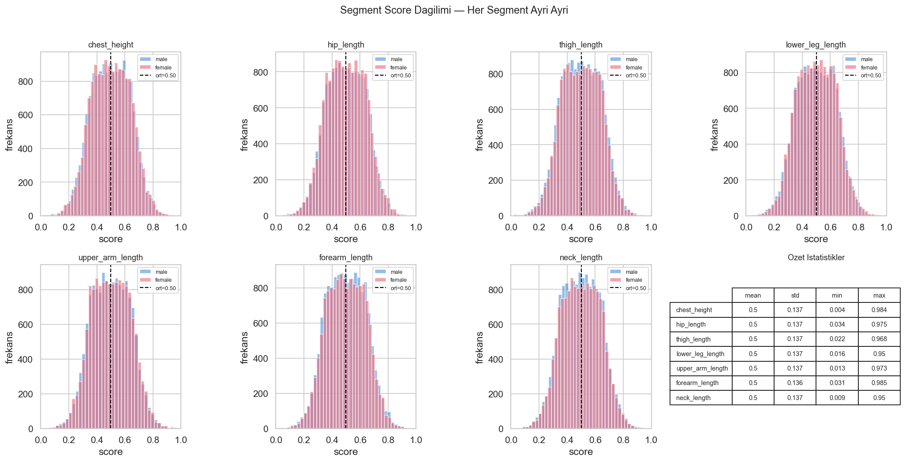
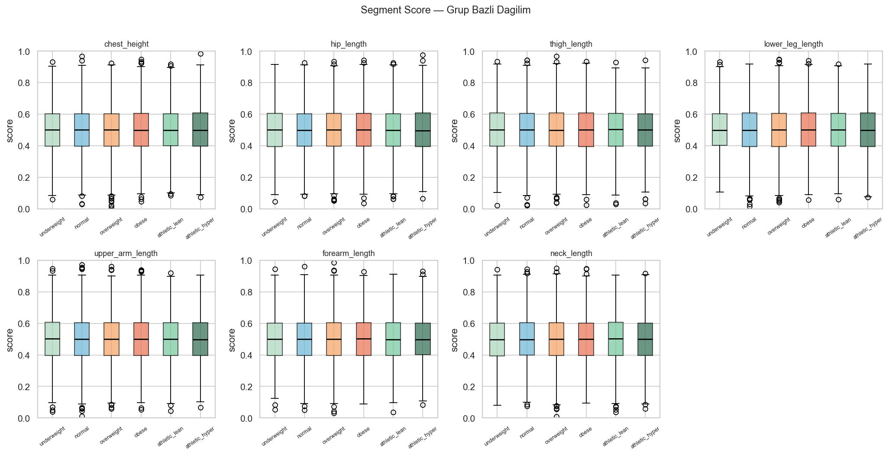
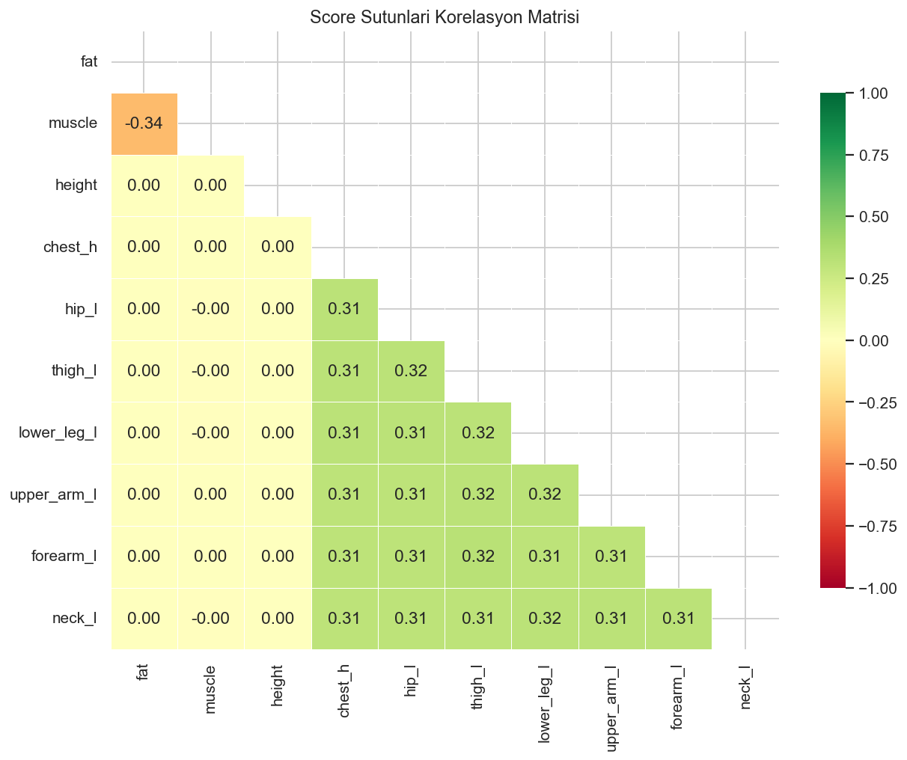
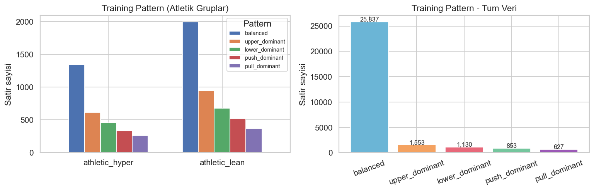

# Dataset EDA — Sentetik Antropometrik Veri

**Tarih:** 2026-05-02  
**Kaynak:** `dataset.csv` — 30,000 satır, `generate_dataset.py` ile üretilmiş  
**Araç:** `docs/eda/generate_plots.py`

> Bu rapor en güncel `dataset.csv` üzerinden otomatik üretilmiştir.  
> Önceki versiyona göre değişiklikler: cinsiyet-bazlı height cap, fat/muscle beta(2,2) dağılımı.

---

## İçindekiler

1. [Genel Bakış](#1-genel-bakis)
2. [Demografik Dağılım](#2-demografik-dagilim)
3. [Height Score](#3-height-score)
4. [Fat & Muscle Score](#4-fat--muscle-score)
5. [Segment Score Spread](#5-segment-score-spread)
   - [5b. Bireysel Dağılımlar](#5b-segment-score--bireysel-dağılımlar)
6. [Korelasyon Analizi](#6-korelasyon-analizi)
7. [Training Pattern](#7-training-pattern)
8. [Açık Konular](#8-acik-konular)

---

## 1. Genel Bakış

| Metrik | Değer |
|---|---|
| Toplam satır | 30,000 |
| Sütun sayısı | 16 |
| Cinsiyet dengesi | 15,000 erkek / 15,000 kadın |
| `height_cm` dolu | **0** — CC5 export sonrası doldurulacak |
| Diğer eksik değer | 0 |

### Sütun Özeti

| Sütun | Tip | Açıklama |
|---|---|---|
| `char_id` | string | Benzersiz karakter ID |
| `gender` | kategori | male / female |
| `age` | int | 14–40 |
| `group` | kategori | 6 vücut tipi grubu |
| `fat_score` | float [0,1] | Grup aralığında beta(2,2) ile örneklendi |
| `muscle_score` | float [0,1] | Grup aralığında beta(2,2) ile örneklendi |
| `height_score` | float | Truncated normal — erkek μ≈175 cm, kadın μ≈160 cm; sınırlar [150, 210/190] cm |
| `*_score` (7 adet) | float [0,1] | Segment uzunluk sapmaları, spread ≤ 0.30 |
| `height_cm` | float | **Boş** — henüz ölçülmedi |
| `training_pattern` | kategori | Sadece atletik gruplarda çeşitli |

---

## 2. Demografik Dağılım

**Gözlemler:**
- Grup başına cinsiyet tam **%50 / %50**.
- Grup büyüklükleri spec'e birebir uygun.

---

| Strata | Satır | Oran |
|---|---|---|
| adolescent (14–18) | 4,050 | %13.5 |
| young_adult (19–29) | 15,264 | %50.9 |
| adult (30–40) | 10,686 | %35.6 |

- Ortalama yaş **26.8**, std **7.25**.
- `athletic_hyper` min yaş = **19** — AGE-02 kuralı doğru uygulanmış.
- Tüm gruplarda yaş ortalaması 26.6–28.6 arası, yaş grup atamasını etkilemiyor.

---

## 3. Height Score

### Özet

| | Erkek | Kadın |
|---|---|---|
| Merkez (hedef) | **0.4284** (≈175 cm) | **0.2954** (≈160 cm) |
| Gerçekleşen ortalama | 0.4284 | 0.3035 |
| Std | 0.062 | 0.055 |
| Alt sınır | 0.20 (≈150 cm) | 0.20 (≈150 cm) |
| Üst sınır | 0.735 (≈210 cm) | 0.561 (≈190 cm) |

### Dağılım

Truncated normal — `truncnorm.ppf` ile LHS quantile'larına uygulandı. Kesme noktaları `[HEIGHT_SCORE_MIN, h_max]`.

- Sınırda yığılan satır: **1** (~%0) — önceki uniform versiyonda %45'ti.
- Histogram'da iki ayrı tepe net görünüyor: kadın ≈0.30, erkek ≈0.43.
- Kadın dağılımı sol sınıra (0.20) daha yakın başladığından hafif sol-kesikli; erkek dağılımı daha simetrik.

---

## 4. Fat & Muscle Score

**Gözlemler:**
- beta(2,2) dönüşümü sayesinde her grubun bulutunun ortasında yoğunlaşma var, uçlarda seyrelme görünüyor — dikdörtgen sertliği giderildi.
- Gruplar birbirinden net ayrışıyor; örtüşme yok.

---

### Grup Ortalamaları

| Grup | fat_score | muscle_score |
|---|---|---|
| underweight | 0.075 | 0.100 |
| normal | 0.255 | 0.200 |
| overweight | 0.480 | 0.250 |
| obese | 0.798 | 0.250 |
| athletic_lean | 0.100 | 0.518 |
| athletic_hyper | 0.100 | 0.830 |

Fat–muscle korelasyonu: **r = −0.35** — biyolojik olarak tutarlı ters ilişki.

---

## 5. Segment Score Spread

`SEG_MAX_DEV = 0.30` — 7 segment skorun max−min aralığı bu değerle kırpılıyor. Sonuç olarak her karakterde tüm segment uzunlukları birbirine orantılı kalıyor (kısa bacak + uzun kol kombinasyonu üretilmiyor). Bu bir tasarım kararı.

| Metrik | Değer |
|---|---|
| Spread ortalaması | 0.2996 |
| Tavanda (≥ 0.30) | 29,763 (%99.2) |
| Tüm segment score ortalaması | ≈ 0.50 |
| Tüm segment score IQR | ≈ [0.40, 0.60] |

Boxplot'ta 7 segmentin neredeyse özdeş dağılım göstermesi beklenen davranış — spread kısıtı uygulanan uniform LHS, her segmenti ortalama etrafında ±0.15 band içinde tutuyor.

---

## 5b. Segment Score — Bireysel Dağılımlar

**Gözlemler:**
- 7 segmentin tümü mean ≈ **0.50**, std ≈ **0.137** ile neredeyse özdeş dağılıyor — spread kısıtının doğal sonucu.
- Cinsiyet (erkek/kadın) segment dağılımlarını etkilemiyor; iki histogram üst üste biniyor.
- Dağılım şekli spread kısıtı altında şaşırtıcı şekilde normal benzeri — LHS'in stratifikasyonu ve merkeze sıkıştırma birlikte bu formu yaratıyor.
- Tüm segmentlerde uçlarda (0.0–0.1 ve 0.9–1.0 arası) örnekler var — `np.clip(0, 1)` sınırına değen az sayıda karakter mevcut.

---

**Gözlemler:**
- Segment score'lar gruptan bağımsız — IQR ve medyan 6 grup için neredeyse aynı. Bu beklenen: segmentler vücut orantısını temsil ediyor, grubun fat/muscle yapısını değil.
- Tüm gruplarda whisker'lar 0'a kadar uzanıyor — her grupta uzak uçlara örnekler var, aykırı değil, tasarım gereği.

---

## 6. Korelasyon Analizi

### Öne Çıkan Korelasyonlar

| Çift | r |
|---|---|
| fat × muscle | −0.35 |
| Tüm segment çiftleri | +0.31 ± 0.01 |
| height × herhangi bir score | ≈ 0.00 |

- **Segment korelasyonları** spread kısıtlamasının yapısal sonucu — tasarım gereği.
- `height_score` hiçbir skorla korele değil — beklenen.
- Fat–muscle negatif ilişki sağlıklı.

---

## 7. Training Pattern

| Pattern | Hedef | Gerçekleşen |
|---|---|---|
| balanced | %45 | %44.5 |
| upper_dominant | %20 | %20.5 |
| lower_dominant | %15 | %14.9 |
| push_dominant | %12 | %11.8 |
| pull_dominant | %8 | %8.3 |

- Non-atletik gruplar %100 `balanced`.
- Atletik gruplarda hedef oranlara yakın — `athletic_lean`: 1,995 / `athletic_hyper`: 1,342 `balanced`.

---

## 8. Açık Konular

| # | Konu | Durum |
|---|---|---|
| 1 | `height_cm` boş | CC5 export pipeline'ı tamamlanacak |
| 2 | Kadın height cap (0.561 ≈ 190 cm) erkek eğrisinden türetildi | Kesin kalibrasyon için female `height_range_probe` çalıştırılacak |
| 3 | Segment spread tasarım gereği %99 tavanda | Tasarım kararı — vücut orantısallığı korunuyor |
